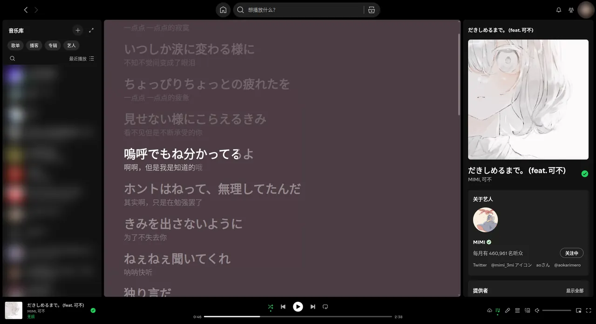
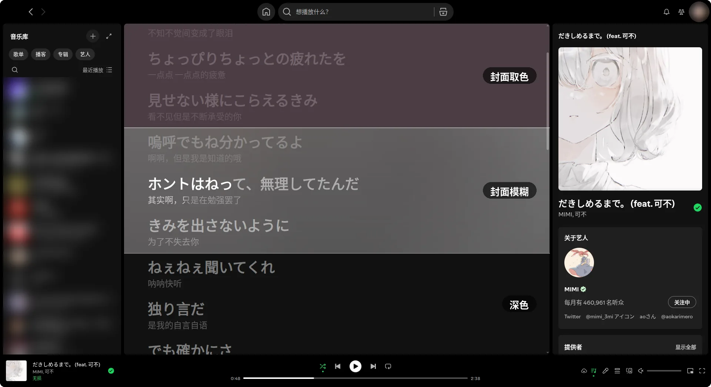
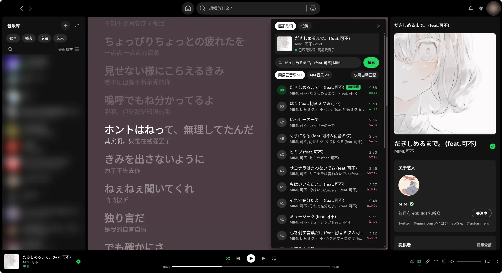
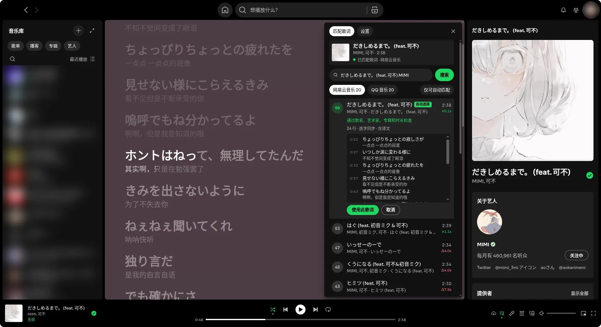
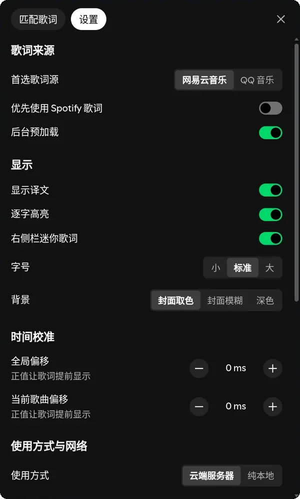
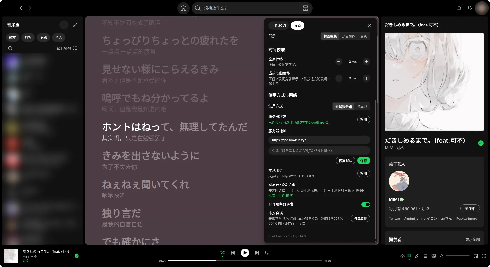
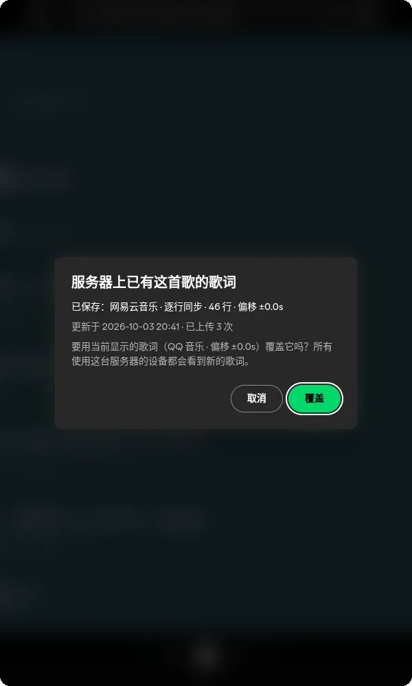

# Spot-Lyric for Spotify

Spotify 桌面客户端第三方歌词插件，支持 Windows / macOS / Linux。

## 界面预览

<p align="center">
  
  <br><sub>逐字高亮 · 双语译文 · 自动跟随滚动</sub>
</p>

<p align="center">
  
  <br><sub>三种背景：封面取色 · 封面模糊 · 深色</sub>
</p>

<table align="center">
  <tr>
    <td align="center" width="33%"><a href="docs/screenshots/mini.webp"></a><br><sub>右侧栏迷你歌词</sub></td>
    <td align="center" width="33%"><a href="docs/screenshots/match.webp"></a><br><sub>手动搜索与匹配</sub></td>
    <td align="center" width="33%"><a href="docs/screenshots/preview.webp"></a><br><sub>预览候选歌词并绑定</sub></td>
  </tr>
  <tr>
    <td align="center"><a href="docs/screenshots/settings.webp"></a><br><sub>歌词来源与显示设置</sub></td>
    <td align="center"><a href="docs/screenshots/network.webp"></a><br><sub>时间校准与网络</sub></td>
    <td align="center"><a href="docs/screenshots/upload.webp"></a><br><sub>上传前检查服务器，确认后覆盖</sub></td>
  </tr>
</table>

## 功能

- 歌词来源：网易云音乐、QQ 音乐，Spotify 官方歌词兜底
- 逐字高亮、双语翻译
- 自动匹配，也可手动搜索、绑定、导入 LRC
- 右侧栏迷你歌词
- 背景：封面取色 / 封面模糊 / 深色
- 字号、时间偏移可调
- 提前匹配队列中接下来的两首歌，切歌即显示
- 可选云端服务器，多设备共享：只通过播放栏的上传按钮手动上传（歌词、匹配和偏移一起），服务器已有歌词时确认后才覆盖

## 安装

**macOS / Linux**

```bash
curl -fsSL https://raw.githubusercontent.com/dibin666/spotify-patch-lryic/main/patch.sh | bash
```

**Windows**（PowerShell）

```powershell
$d="$env:TEMP\spot-lyric"; Remove-Item $d -Recurse -Force -ErrorAction SilentlyContinue; Invoke-WebRequest https://github.com/dibin666/spotify-patch-lryic/archive/refs/heads/main.zip -OutFile "$d.zip"; Expand-Archive "$d.zip" $d -Force; powershell -NoProfile -ExecutionPolicy Bypass -File "$d\spotify-patch-lryic-main\patch.ps1"
```

在仓库目录中运行 `./patch.sh`（Windows 为 `patch.cmd`），按提示选择即可。安装过之后再运行，会直接询问「更新 / 重新设置 / 卸载」，默认沿用上次的设置更新。

安装命令只下载补丁脚本和歌词插件；本地服务程序（spot-lyric-server）只在选择「纯本地」时才下载或编译。

> Windows 不支持 Microsoft Store 版 Spotify。

## 使用方式

| 方式 | 说明 |
| --- | --- |
| 云端服务器 | 多设备共享匹配（默认） |
| 纯本地 | 不连接任何远程服务器 |

## 命令

以下以 `./patch.sh` 为例，Windows 换成 `patch.cmd`。

| 操作 | 命令 |
| --- | --- |
| 安装 / 更新 | `./patch.sh` |
| 纯本地安装 | `./patch.sh --mode local -y` |
| 状态 | `./patch.sh status` |
| 还原 | `./patch.sh restore` |
| 卸载 | `./patch.sh uninstall` |

更多选项见 `./patch.sh --help`。

## 自建服务器（可选）

```bash
cd server
cp .env.example .env
docker compose up -d --build
```

安装时填写服务器地址，或在「歌词设置 > 使用方式与网络」中修改。

## 开发

```bash
go vet ./... && go test ./...
node --test tests/*.test.mjs
```
[Linux DO](https://linux.do)
