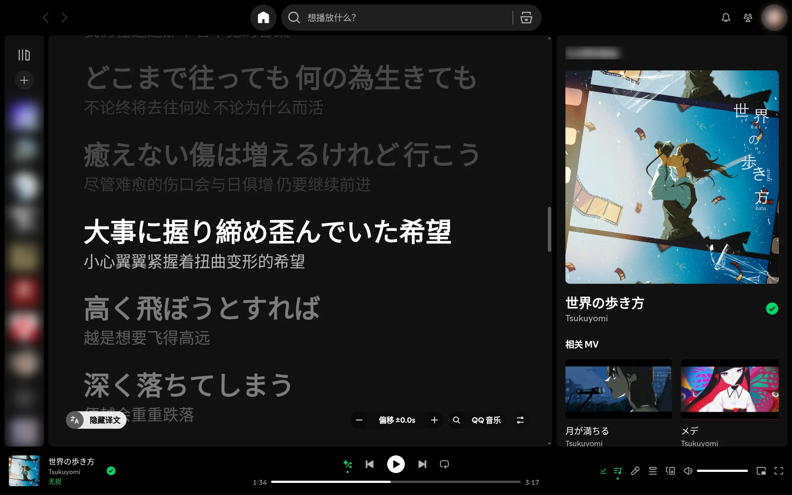
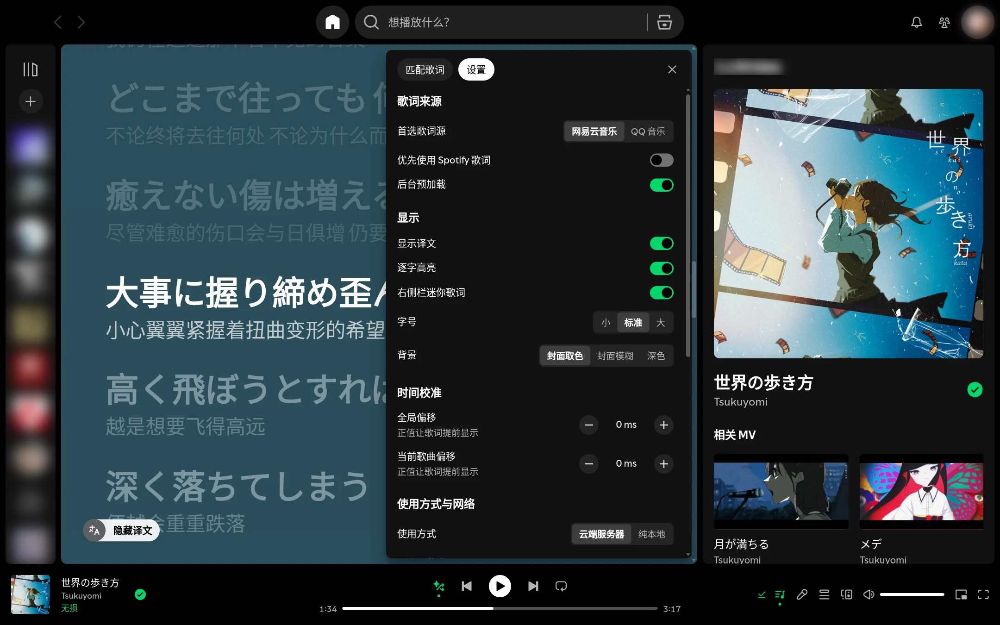
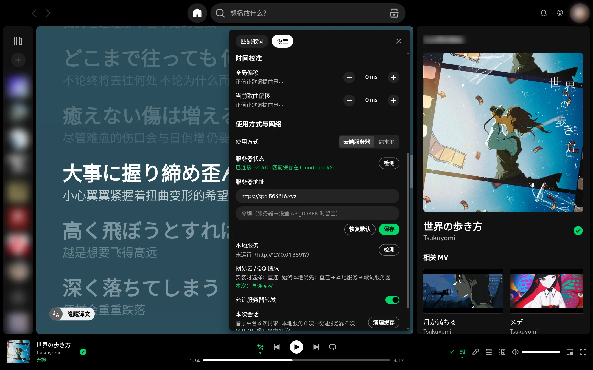

# Spot-Lyric for Spotify

Spotify 桌面客户端第三方歌词插件，支持 Windows / macOS / Linux。

## 界面预览

| 封面取色 · 双语歌词 | 封面模糊背景 | 深色极简背景 |
| :---: | :---: | :---: |
| [](docs/screenshots/01-lyrics.webp)<br><b>主界面·封面取色</b><br>自适应提取专辑色彩，双语歌词同步滚动，支持点击歌词随时随心跳转播放进度 | [](docs/screenshots/02-blur.webp)<br><b>封面模糊背景</b><br>柔和毛玻璃视觉效果，随曲目封面动态流转，营造更沉浸的听歌氛围 | [](docs/screenshots/03-dark.webp)<br><b>深色极简背景</b><br>纯粹低调的暗色主题，高对比度清晰呈现歌词正文，夜间使用更加舒适护眼 |
| **纯原文显示** | **右侧栏迷你歌词** | **手动搜索与匹配** |
| [](docs/screenshots/04-original.webp)<br><b>纯原文显示</b><br>支持一键切换隐藏翻译，专注原文歌词与排版，逐行/逐字动态高亮精准随行 | [](docs/screenshots/05-mini.webp)<br><b>右侧栏迷你歌词</b><br>无缝嵌入侧边信息栏，浏览歌曲与主页时歌词如影随形，支持快捷折叠与关闭 | [](docs/screenshots/06-match.webp)<br><b>手动搜索与匹配</b><br>聚合网易云与 QQ 音乐源，按匹配度综合打分，支持歌曲链接或关键词一键直达 |
| **歌词预览与绑定** | **显示与歌词设置** | **时间校准与网络** |
| [](docs/screenshots/07-preview.webp)<br><b>歌词预览与绑定</b><br>直观查看各候选歌词行数、时间轴与翻译，支持一键锁定绑定或本地导入导出 LRC | [](docs/screenshots/08-settings.webp)<br><b>显示与歌词设置</b><br>首选歌词源、逐字高亮、字号大小（小/标准/大）及背景样式自由定制 | [](docs/screenshots/09-network.webp)<br><b>时间校准与网络</b><br>支持全局与单曲毫秒级时间偏移微调，云端与纯本地模式切换，会话统计与缓存管理 |

## 功能

- 歌词来源：网易云音乐、QQ 音乐，Spotify 官方歌词兜底
- 逐字高亮、双语翻译
- 自动匹配，也可手动搜索、绑定、导入 LRC
- 右侧栏迷你歌词
- 背景：封面取色 / 封面模糊 / 深色
- 字号、时间偏移可调
- 可选云端服务器，多设备共享匹配

## 安装

**macOS / Linux**

```bash
curl -fsSL https://raw.githubusercontent.com/dibin666/spotify-patch-lryic/main/patch.sh | bash
```

**Windows**（PowerShell）

```powershell
$d="$env:TEMP\spot-lyric"; Remove-Item $d -Recurse -Force -ErrorAction SilentlyContinue; Invoke-WebRequest https://github.com/dibin666/spotify-patch-lryic/archive/refs/heads/main.zip -OutFile "$d.zip"; Expand-Archive "$d.zip" $d -Force; powershell -NoProfile -ExecutionPolicy Bypass -File "$d\spotify-patch-lryic-main\patch.ps1"
```

在仓库目录中运行 `./patch.sh`（Windows 为 `patch.cmd`），按提示选择即可。安装过之后再运行，会直接询问「更新 / 重新设置 / 卸载」，默认沿用上次的设置更新。

安装命令只下载补丁脚本和歌词插件；本地服务程序（spot-lyric-server）只在选择「纯本地」时才下载或编译。

> Windows 不支持 Microsoft Store 版 Spotify。

## 使用方式

| 方式 | 说明 |
| --- | --- |
| 云端服务器 | 多设备共享匹配（默认） |
| 纯本地 | 不连接任何远程服务器 |

## 命令

以下以 `./patch.sh` 为例，Windows 换成 `patch.cmd`。

| 操作 | 命令 |
| --- | --- |
| 安装 / 更新 | `./patch.sh` |
| 纯本地安装 | `./patch.sh --mode local -y` |
| 状态 | `./patch.sh status` |
| 还原 | `./patch.sh restore` |
| 卸载 | `./patch.sh uninstall` |

更多选项见 `./patch.sh --help`。

## 自建服务器（可选）

```bash
cd server
cp .env.example .env
docker compose up -d --build
```

安装时填写服务器地址，或在「歌词设置 > 使用方式与网络」中修改。

## 开发

```bash
go vet ./... && go test ./...
node --test tests/*.test.mjs
```
[Linux DO](https://linux.do)
